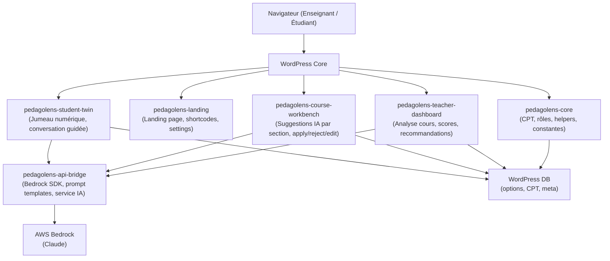
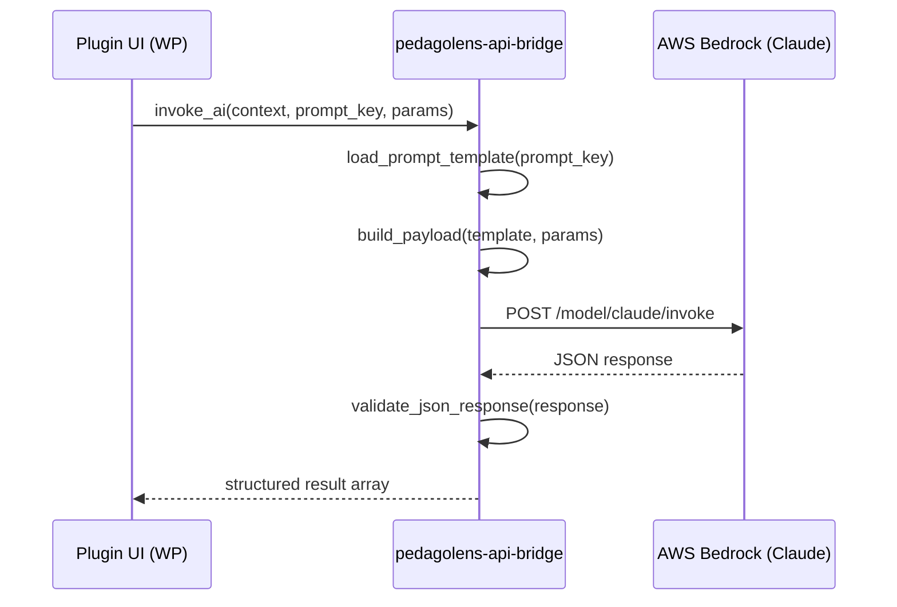

# Design Technique — PédagoLens Platform

## Overview

PédagoLens est une plateforme WordPress d'assistance pédagogique par IA, composée de 6 plugins PHP custom qui s'articulent autour d'un noyau commun. L'IA est fournie par AWS Bedrock (Claude), appelé via un plugin bridge dédié. L'architecture sépare strictement la couche UI/WordPress, la couche bridge IA, et la logique métier pédagogique.

### Objectifs principaux

- Permettre aux enseignants d'analyser leurs cours et d'obtenir des recommandations IA par profil d'apprenant
- Permettre aux étudiants d'interagir avec un jumeau numérique guidé et configurable
- Exposer une landing page marketing premium entièrement éditable via les settings WP
- Centraliser la configuration (prompts, profils, comportements) dans l'admin WordPress
- Garantir des réponses IA structurées en JSON pour une intégration fiable

### Contraintes techniques

- WordPress 6.x comme runtime principal (hooks, CPT, options API, REST API)
- PHP 8.1+ pour tous les plugins
- AWS Bedrock SDK (PHP) pour les appels Claude
- Réponses IA en JSON structuré et validé
- Pas de dépendance à des services tiers autres qu'AWS Bedrock

---

## Architecture

### Vue d'ensemble



### Flux de données IA



### Principes d'architecture

1. **Découplage strict** : chaque plugin ne connaît que les interfaces exposées par `pedagolens-core` et `pedagolens-api-bridge`
2. **Configuration centralisée** : tous les prompts, profils et comportements sont stockés dans les options WP et éditables via l'admin
3. **Réponses JSON contractuelles** : le bridge valide la structure JSON avant de la retourner ; les plugins consommateurs ne font pas de parsing ad hoc
4. **Hooks WordPress** : la communication inter-plugins passe par des actions/filtres WP nommés (`pedagolens_*`)
5. **Rôles dédiés** : `pedagolens_teacher` et `pedagolens_student` créés par le core

---

## Components and Interfaces

### 1. pedagolens-core

Responsabilités : constantes globales, enregistrement des CPT, gestion des rôles, helpers partagés, gestion des profils d'apprenants.

```php
// Interface publique principale
PedagoLens_Core::get_option(string $key, mixed $default): mixed
PedagoLens_Core::update_option(string $key, mixed $value): bool
PedagoLens_Core::register_cpt(string $post_type, array $args): void
PedagoLens_Core::get_user_role(int $user_id): string  // 'teacher' | 'student' | 'admin'
PedagoLens_Core::log(string $level, string $message, array $context = []): void
```

CPT enregistrés :
- `pl_analysis` — résultats d'analyse de cours
- `pl_course` — cours enrichis (avec `_pl_course_type` : `magistral` | `exercice` | `evaluation` | `travail_equipe`)
- `pl_interaction` — historique conversations jumeau
- `pl_project` — projet d'amélioration pédagogique (magistral ou exercice)

#### PedagoLens_Profile_Manager

Fichier : `includes/class-profile-manager.php` dans `pedagolens-core`.

Responsabilités : CRUD des profils d'apprenants stockés en options WP, gestion de l'index, validation des slugs, seed des profils par défaut.

```php
// Interface publique — toutes les méthodes sont statiques
PedagoLens_Profile_Manager::get_all(bool $active_only = true): array
PedagoLens_Profile_Manager::get(string $slug): array|null
PedagoLens_Profile_Manager::save(array $profile_data): bool
PedagoLens_Profile_Manager::delete(string $slug): bool        // soft delete : is_active = false
PedagoLens_Profile_Manager::duplicate(string $slug, string $new_slug): bool
PedagoLens_Profile_Manager::get_index(): array
PedagoLens_Profile_Manager::reorder(array $slugs): bool
```

Structure d'un profil (option WP `pl_profile_{slug}`) :
```json
{
  "slug": "concentration_tdah",
  "name": "TDAH / Concentration",
  "description": "Étudiant avec TDAH ou difficultés de concentration",
  "is_active": true,
  "sort_order": 1,
  "system_prompt": "",
  "resources": "",
  "scoring_grid": [
    { "min": 90, "max": 100, "label": "Très accessible", "color": "green" },
    { "min": 70, "max": 89,  "label": "Accessible",      "color": "blue" },
    { "min": 50, "max": 69,  "label": "Difficile",        "color": "yellow" },
    { "min": 30, "max": 49,  "label": "Très difficile",   "color": "orange" },
    { "min": 0,  "max": 29,  "label": "Inaccessible",     "color": "red" }
  ],
  "inject_resources": true,
  "inject_scoring": true,
  "created_at": "2026-03-21T00:00:00Z",
  "updated_at": "2026-03-21T00:00:00Z"
}
```

Index : `pl_profile_index` (array de slugs) — permet de lister les profils sans scanner toutes les options WP.

### 2. pedagolens-api-bridge

Responsabilités : appels AWS Bedrock, gestion des prompt templates, validation des réponses JSON.

```php
// Interface publique principale
PedagoLens_API_Bridge::invoke(string $prompt_key, array $params): array
PedagoLens_API_Bridge::get_prompt_template(string $key): string
PedagoLens_API_Bridge::validate_response(array $response, string $schema_key): bool
PedagoLens_API_Bridge::get_available_models(): array
```

Prompt templates stockés en options WP (`pl_prompt_{key}`), éditables via l'admin.

`invoke()` et `invoke_mock()` lisent les profils actifs dynamiquement via `PedagoLens_Profile_Manager::get_all(active_only: true)` — aucune référence statique aux 7 slugs hardcodés.

### 3. pedagolens-landing

Responsabilités : landing page marketing, shortcodes/blocs Gutenberg, settings éditables.

```php
// Shortcodes exposés
[pedagolens_hero title="" subtitle="" cta_text="" cta_url=""]
[pedagolens_features]
[pedagolens_pricing]
[pedagolens_testimonials]
```

Settings admin : titre, sous-titre, CTA, couleurs, sections visibles, contenu des blocs.

### 4. pedagolens-teacher-dashboard

Responsabilités : analyse de contenu de cours, calcul de scores par profil d'apprenant, recommandations IA.

```php
// Interface principale
PedagoLens_Teacher_Dashboard::analyze_course(int $course_id): array
PedagoLens_Teacher_Dashboard::get_profile_scores(int $analysis_id): array
PedagoLens_Teacher_Dashboard::get_recommendations(int $analysis_id): array
PedagoLens_Teacher_Dashboard::save_analysis(int $course_id, array $result): int
```

Profils d'apprenants configurables via settings WP (`pl_learner_profiles`) — 7 profils : `concentration_tdah`, `surcharge_cognitive`, `langue_seconde`, `faible_autonomie`, `anxieux_consignes`, `avance_rapide`, `usage_passif_ia`.

### 5. pedagolens-course-workbench

Responsabilités : affichage détaillé d'un cours, suggestions IA par section, actions apply/reject/edit/compare/save.

```php
// Interface principale
PedagoLens_Course_Workbench::get_suggestions(int $course_id, string $section): array
PedagoLens_Course_Workbench::apply_suggestion(int $course_id, string $section, int $suggestion_id): bool
PedagoLens_Course_Workbench::reject_suggestion(int $course_id, string $section, int $suggestion_id): bool
PedagoLens_Course_Workbench::save_version(int $course_id, string $section, string $content): int
PedagoLens_Course_Workbench::compare_versions(int $course_id, string $section): array
```

### 6. pedagolens-student-twin

Responsabilités : jumeau numérique étudiant, conversation guidée, garde-fous configurables.

```php
// Interface principale
PedagoLens_Student_Twin::start_session(int $student_id, int $course_id): string  // session_id
PedagoLens_Student_Twin::send_message(string $session_id, string $message): array
PedagoLens_Student_Twin::get_history(string $session_id): array
PedagoLens_Student_Twin::end_session(string $session_id): bool
PedagoLens_Student_Twin::apply_guardrails(string $message, array $config): array
```

Garde-fous configurables : sujets interdits, longueur max réponse, ton, niveau de détail.

---

## Data Models

### Options WordPress (wp_options)

| Clé option | Type | Description |
|---|---|---|
| `pl_ai_mode` | string | `mock` ou `bedrock` |
| `pl_bedrock_region` | string | Région AWS (défaut : `us-east-1`) |
| `pl_bedrock_model_id` | string | ID modèle Claude (défaut : `anthropic.claude-sonnet-4-20250514-v2:0`) |
| `pl_bedrock_max_tokens` | int | Tokens max par appel (défaut : 1500) |
| `pl_bedrock_temperature` | float | Température (défaut : 0.3) |
| `pl_profile_index` | JSON array | Index des slugs de profils (ex. `["concentration_tdah", ...]`) |
| `pl_profile_{slug}` | JSON object | Données complètes d'un profil (voir structure Profile_Manager) |
| `pl_prompt_{key}` | string | Template de prompt par clé (5 clés) |
| `pl_guardrails_config` | JSON object | Config garde-fous jumeau |
| `pl_landing_settings` | JSON object | Settings landing page |
| `pl_teacher_dashboard_settings` | JSON object | Settings dashboard enseignant |
| `pl_workbench_settings` | JSON object | Settings workbench |
| `pl_student_twin_settings` | JSON object | Settings jumeau numérique |

**Credentials AWS** — jamais dans les options WP, lus exclusivement via :
```php
defined('AWS_ACCESS_KEY_ID') ? AWS_ACCESS_KEY_ID : getenv('AWS_ACCESS_KEY_ID')
defined('AWS_SECRET_ACCESS_KEY') ? AWS_SECRET_ACCESS_KEY : getenv('AWS_SECRET_ACCESS_KEY')
defined('AWS_SESSION_TOKEN') ? AWS_SESSION_TOKEN : getenv('AWS_SESSION_TOKEN')
```

**Profils pédagogiques** — gérés par `PedagoLens_Profile_Manager` (voir section Components). Chaque profil est stocké dans `pl_profile_{slug}` ; l'index des slugs dans `pl_profile_index`. L'option `pl_learner_profiles` est dépréciée et remplacée par ce mécanisme.

### CPT : pl_analysis

```
post_type: pl_analysis
post_title: "Analyse — {course_title} — {date}"
post_status: publish | draft
meta:
  _pl_course_id: int
  _pl_profile_scores: JSON  // { "concentration_tdah": 54, "surcharge_cognitive": 67, "langue_seconde": 61, "faible_autonomie": 70, "anxieux_consignes": 58, "avance_rapide": 88, "usage_passif_ia": 72 }
  _pl_recommendations: JSON  // [{ "section": str, "text": str, "priority": int, "profile_target": str }]
  _pl_raw_response: JSON     // réponse brute Bedrock
  _pl_analyzed_at: datetime
  _pl_summary: string
  _pl_impact_estimates: JSON // { "suggestion_id": { "concentration_tdah": +8, "langue_seconde": +5, ... } }
```

### CPT : pl_course

```
post_type: pl_course
post_title: titre du cours
post_content: contenu principal
post_status: publish | draft
meta:
  _pl_sections: JSON  // [{ "id": str, "title": str, "content": str, "suggestions": [] }]
  _pl_versions: JSON  // historique des versions par section
  _pl_last_workbench_at: datetime
  _pl_course_type: string  // magistral | exercice | evaluation | travail_equipe
```

### CPT : pl_project

```
post_type: pl_project
post_title: titre du projet
post_status: publish | draft
meta:
  _pl_course_id: int
  _pl_project_type: string  // magistral | exercice | evaluation | travail_equipe
  _pl_content_sections: JSON  // array des sections du contenu
  _pl_profile_scores: JSON    // scores /100 par profil et par section
  _pl_recommendations: JSON   // recommandations par section et par profil
  _pl_impact_estimates: JSON  // impact estimé de chaque suggestion par profil
  _pl_versions: JSON          // historique des versions du contenu
  _pl_created_at: datetime
  _pl_updated_at: datetime
```

### CPT : pl_interaction

```
post_type: pl_interaction
post_title: "Session — {student_id} — {session_id}"
post_status: publish
meta:
  _pl_student_id: int
  _pl_course_id: int
  _pl_session_id: string (UUID)
  _pl_messages: JSON  // [{ "role": "user"|"assistant", "content": str, "timestamp": datetime }]
  _pl_started_at: datetime
  _pl_ended_at: datetime | null
  _pl_guardrails_applied: JSON  // log des garde-fous déclenchés
```

### Structure JSON réponse IA — Analyse de cours

```json
{
  "profile_scores": {
    "concentration_tdah": 54,
    "surcharge_cognitive": 67,
    "langue_seconde": 61,
    "faible_autonomie": 70,
    "anxieux_consignes": 58,
    "avance_rapide": 88,
    "usage_passif_ia": 72
  },
  "recommendations": [
    {
      "section": "string",
      "text": "string",
      "priority": 1,
      "profile_target": "concentration_tdah"
    }
  ],
  "impact_estimates": {
    "suggestion_id": {
      "concentration_tdah": 8,
      "langue_seconde": 5,
      "avance_rapide": -2
    }
  },
  "summary": "string"
}
```

### Structure JSON réponse IA — Suggestions workbench

```json
{
  "suggestions": [
    {
      "id": "string",
      "section": "string",
      "original": "string",
      "proposed": "string",
      "rationale": "string",
      "profile_target": "string"
    }
  ]
}
```

### Structure JSON réponse IA — Message jumeau

```json
{
  "reply": "string",
  "guardrail_triggered": false,
  "guardrail_reason": null,
  "follow_up_questions": ["string"]
}
```


---

## Correctness Properties

*A property is a characteristic or behavior that should hold true across all valid executions of a system — essentially, a formal statement about what the system should do. Properties serve as the bridge between human-readable specifications and machine-verifiable correctness guarantees.*

### Property 1 : Options round-trip (core)

*For any* clé d'option et valeur valide, écrire la valeur via `update_option` puis la lire via `get_option` doit retourner une valeur égale à celle écrite.

**Validates: Requirements 1.5**

---

### Property 2 : Valeur par défaut sur clé absente (core)

*For any* clé d'option inexistante et valeur par défaut arbitraire, `get_option` doit retourner exactement la valeur par défaut fournie.

**Validates: Requirements 1.4**

---

### Property 3 : Capacités du rôle teacher (core)

*For any* utilisateur WordPress auquel on assigne le rôle `pedagolens_teacher`, cet utilisateur doit posséder toutes les capacités de gestion de cours définies dans la configuration du rôle.

**Validates: Requirements 1.2**

---

### Property 4 : Isolation du rôle student (core)

*For any* utilisateur WordPress auquel on assigne le rôle `pedagolens_student`, cet utilisateur ne doit posséder aucune capacité d'édition de cours.

**Validates: Requirements 1.3**

---

### Property 5 : Prompt template round-trip (api-bridge)

*For any* clé de prompt template et contenu de template valide, mettre à jour le template puis le relire via `get_prompt_template` doit retourner le contenu exact mis à jour.

**Validates: Requirements 2.3**

---

### Property 6 : Validation JSON bidirectionnelle (api-bridge)

*For any* réponse JSON, `validate_response` doit retourner `true` si et seulement si la réponse est conforme au schéma attendu — et `false` pour toute réponse non conforme (champs manquants, mauvais types, structure incorrecte).

**Validates: Requirements 2.4, 2.5**

---

### Property 7 : Réponse bridge structurée (api-bridge)

*For any* appel à `invoke` avec un prompt_key valide et une réponse Bedrock mockée conforme, le résultat retourné doit être un tableau PHP dont les clés correspondent au schéma JSON déclaré pour ce prompt_key.

**Validates: Requirements 2.1**

---

### Property 8 : Rejet des réponses Bedrock invalides (api-bridge)

*For any* réponse JSON malformée ou non conforme retournée par Bedrock, `invoke` doit lever une exception ou retourner un tableau d'erreur structuré — jamais retourner silencieusement des données partielles.

**Validates: Requirements 2.2**

---

### Property 9 : Scores couvrent tous les profils configurés (teacher-dashboard)

*For any* cours et ensemble de profils d'apprenants configurés, le résultat de `analyze_course` doit contenir un score numérique pour chaque profil de la configuration — ni plus, ni moins.

**Validates: Requirements 3.1**

---

### Property 10 : Persistance de l'analyse (teacher-dashboard)

*For any* cours analysé via `analyze_course`, un CPT `pl_analysis` doit exister en base avec les métadonnées `_pl_course_id`, `_pl_profile_scores`, `_pl_recommendations`, `_pl_summary` et `_pl_impact_estimates` correspondant au résultat retourné.

**Validates: Requirements 3.2**

---

### Property 11 : Structure des suggestions workbench (course-workbench)

*For any* cours et section valides, chaque suggestion retournée par `get_suggestions` doit contenir les champs `id`, `section`, `original`, `proposed` et `rationale` avec des valeurs non vides.

**Validates: Requirements 4.1**

---

### Property 12 : Apply suggestion met à jour le contenu (course-workbench)

*For any* suggestion valide, après `apply_suggestion`, le contenu de la section doit être égal au champ `proposed` de la suggestion appliquée.

**Validates: Requirements 4.2**

---

### Property 13 : Reject suggestion préserve le contenu (course-workbench)

*For any* suggestion valide, après `reject_suggestion`, le contenu de la section doit être identique au contenu avant l'appel.

**Validates: Requirements 4.3**

---

### Property 14 : Historique des versions complet (course-workbench)

*For any* séquence de N sauvegardes via `save_version` sur la même section, `compare_versions` doit retourner exactement N entrées dans l'ordre chronologique.

**Validates: Requirements 4.4**

---

### Property 15 : Unicité des session_id (student-twin)

*For any* ensemble de N sessions démarrées via `start_session`, tous les session_id retournés doivent être distincts deux à deux.

**Validates: Requirements 5.1**

---

### Property 16 : Structure de réponse message (student-twin)

*For any* message envoyé dans une session active via `send_message`, la réponse doit contenir les champs `reply` (string non vide), `guardrail_triggered` (bool) et `follow_up_questions` (array).

**Validates: Requirements 5.2**

---

### Property 17 : Garde-fous bidirectionnels (student-twin)

*For any* configuration de garde-fous et message, `apply_guardrails` doit retourner `guardrail_triggered = true` si et seulement si le message contient un sujet interdit selon la configuration — et `false` sinon.

**Validates: Requirements 5.3, 5.4**

---

### Property 18 : Historique ordonné (student-twin)

*For any* session avec N messages envoyés, `get_history` doit retourner exactement N messages dans l'ordre chronologique d'envoi.

**Validates: Requirements 5.5**

---

### Property 19 : Session terminée refuse les messages (student-twin)

*For any* session terminée via `end_session`, tout appel ultérieur à `send_message` sur cette session doit retourner une erreur ou être rejeté — jamais traité comme un message valide.

**Validates: Requirements 5.6**

---

### Property 20 : Settings landing reflétés dans le rendu (landing)

*For any* configuration de settings landing, le HTML rendu par le shortcode `pedagolens_hero` doit contenir le titre, le sous-titre et le texte CTA tels que configurés.

**Validates: Requirements 6.1, 6.2**

---

### Property 21 : Profile round-trip (core)

*For any* profil valide sauvegardé via `Profile_Manager::save`, un appel immédiat à `Profile_Manager::get` avec le même slug doit retourner un tableau dont les champs `slug`, `name`, `is_active`, `system_prompt` et `scoring_grid` sont égaux aux valeurs sauvegardées.

**Validates: Requirements 1.7, 7.3**

---

### Property 22 : Index cohérent après save/delete (core)

*For any* séquence d'opérations `save` et `delete` sur des profils, `Profile_Manager::get_index()` doit contenir exactement les slugs des profils sauvegardés et non supprimés (soft delete exclu de l'index si `is_active = false`).

**Validates: Requirements 1.7**

---

### Property 23 : Profils actifs couverts par mock (api-bridge)

*For any* ensemble de profils actifs retournés par `Profile_Manager::get_all(active_only: true)`, la réponse mock de `invoke('course_analysis', $params)` doit contenir un score pour chaque profil actif — ni plus, ni moins.

**Validates: Requirements 2.1, 2.6**

---

### Property 24 : Suppression bloquée si profil utilisé (core)

*For any* slug de profil référencé dans au moins un CPT `pl_analysis` existant, `Profile_Manager::delete` doit retourner `false` et ne pas modifier `is_active` du profil.

**Validates: Requirements 1.7**

---

## Error Handling

### Stratégie générale

Tous les plugins suivent une convention d'erreur uniforme basée sur les `WP_Error` WordPress et les exceptions PHP pour les couches service.

```php
// Convention de retour d'erreur
[
  'success' => false,
  'error_code' => 'pl_bedrock_timeout',
  'error_message' => 'AWS Bedrock did not respond within the timeout period.',
  'context' => []
]
```

### Erreurs par couche

**pedagolens-api-bridge**
- `pl_bedrock_auth_error` — credentials AWS invalides ou absents
- `pl_bedrock_timeout` — timeout dépassé (configurable, défaut 30s)
- `pl_bedrock_invalid_response` — réponse non JSON ou non conforme au schéma
- `pl_bedrock_rate_limit` — quota Bedrock dépassé
- `pl_prompt_not_found` — clé de prompt template inexistante

**pedagolens-teacher-dashboard**
- `pl_course_not_found` — cours introuvable
- `pl_analysis_failed` — échec de l'analyse IA (propagé depuis le bridge)
- `pl_no_profiles_configured` — aucun profil d'apprenant configuré

**pedagolens-course-workbench**
- `pl_suggestion_not_found` — suggestion_id inexistant
- `pl_section_not_found` — section inexistante dans le cours
- `pl_version_save_failed` — échec de sauvegarde de version

**pedagolens-student-twin**
- `pl_session_not_found` — session_id inexistant
- `pl_session_ended` — session déjà terminée
- `pl_guardrail_blocked` — message bloqué par un garde-fou (retourné normalement, pas comme erreur)
- `pl_twin_response_failed` — échec de génération de réponse IA

### Logging

Toutes les erreurs sont loggées via `PedagoLens_Core::log()` avec les niveaux `error`, `warning`, `info`. Les logs sont écrits dans le debug log WordPress (`WP_DEBUG_LOG`).

---

## Testing Strategy

### Approche duale

La stratégie de test combine tests unitaires et tests basés sur les propriétés (property-based testing). Les deux sont complémentaires et nécessaires.

- **Tests unitaires** : exemples spécifiques, cas limites, conditions d'erreur, intégration entre composants
- **Tests de propriétés** : propriétés universelles vérifiées sur des entrées générées aléatoirement (minimum 100 itérations par propriété)

### Framework recommandé

- **PHP** : [PHPUnit](https://phpunit.de/) pour les tests unitaires
- **Property-based testing** : [Eris](https://github.com/giorgiosironi/eris) (library PBT pour PHP) ou [php-quickcheck](https://github.com/steos/php-quickcheck)
- **Mocking AWS Bedrock** : mock HTTP via `WP_HTTP_TestCase` ou Mockery

### Tests unitaires — exemples et cas limites

Chaque plugin doit couvrir :
- Activation/désactivation (CPT enregistrés, rôles créés)
- Cas d'erreur explicites (clé absente, session terminée, JSON invalide)
- Intégration core ↔ bridge (appel invoke avec mock Bedrock)
- Rendu des shortcodes landing avec settings variés

### Tests de propriétés — configuration

Chaque propriété du document de design doit être implémentée par **un seul test de propriété** avec :
- Minimum **100 itérations**
- Un tag de référence en commentaire :

```php
// Feature: pedagolens-platform, Property 1: Options round-trip (core)
```

### Mapping propriétés → tests

| Propriété | Plugin | Type de test |
|---|---|---|
| P1 Options round-trip | core | property |
| P2 Valeur par défaut | core | property |
| P3 Capacités teacher | core | property |
| P4 Isolation student | core | property |
| P5 Prompt template round-trip | api-bridge | property |
| P6 Validation JSON bidirectionnelle | api-bridge | property |
| P7 Réponse bridge structurée | api-bridge | property |
| P8 Rejet réponses invalides | api-bridge | property |
| P9 Scores tous profils | teacher-dashboard | property |
| P10 Persistance analyse | teacher-dashboard | property |
| P11 Structure suggestions | course-workbench | property |
| P12 Apply met à jour contenu | course-workbench | property |
| P13 Reject préserve contenu | course-workbench | property |
| P14 Historique versions complet | course-workbench | property |
| P15 Unicité session_id | student-twin | property |
| P16 Structure réponse message | student-twin | property |
| P17 Garde-fous bidirectionnels | student-twin | property |
| P18 Historique ordonné | student-twin | property |
| P19 Session terminée refuse messages | student-twin | property |
| P20 Settings landing dans rendu | landing | property |
| P21 Profile round-trip | core | property |
| P22 Index cohérent après save/delete | core | property |
| P23 Profils actifs couverts par mock | api-bridge | property |
| P24 Suppression bloquée si profil utilisé | core | property |
